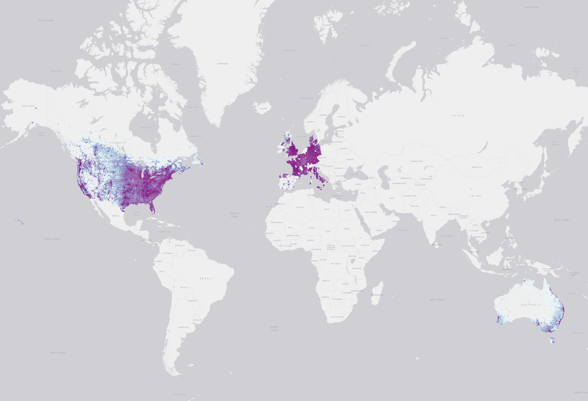

## Introduction

Bing Maps is releasing open building footprints around the world. We have detected **1.3B** buildings from Bing Maps imagery between 2014 and 2024 including Maxar, Airbus, and IGN France imagery. The data is freely available for download and use under ODbL. This dataset includes our [other releases](#will-there-be-more-data-coming-for-other-geographies). 

## Updates
* 2024-06-03 - Added **637K** building footprint edits and **627K** height estimated derived from Maxar and Vexcel imagery between 2020 and 2024. Primary contribution is in the United States (631K). dataset-links.csv was updated on 3 June 2024.
* 2024-05-01 - Added **596K** building footprint edits and **125K** height estimated derived from Maxar and Vexcel imagery between 2017 and 2023. Primary contributions are in France (525K) and Germany (44K). dataset-links.csv was updated on 1 May 2024.
* 2024-03-26 - Added **128M** building footprint edits and **3.5M** height estimated derived from Maxar and Vexcel imagery between 2019 and 2023. Primary contributions are in India (110M) and Nepal (7M). dataset-links.csv was updated on 1 April 2024.
* 2024-03-01 - added **58M** new building footprint edits and **10M** height estimates derived from Maxar and Vexcel imagery between 2019 and 2023. The largest contributions are to Brazil (43M), United States (4.7M), and Germany (3.5M).  
* 2024-02-01 - added **47M** new building footprint edits and **26M** height estimates derived from Maxar, Vexcel and IGN-France imagery between 2016 and 2023. The largest contributions are to Germany (8M) and United States (8M).  
* 2024-01-03 - added **35M** new building footprint edits and **15M** height estimates derived from Vexcel and Maxar imagery between 2016 and 2022. The largest contributions are to Brazil (19M) and Italy (15M). 
* 2023-12-01 - added **69M** building footprint edits and **2M** height estimates derived from Maxar and Vexcel imagery between 2015 and 2023. Biggest contributions are Egypt (11M), Algeria (8M), and France (7M). We've added confidence scores to new footprints. See [Building confidence scores](#building-confidence-scores).  
* 2023-10-20 - Added **95M** building footprint edits and **9M** height estimates derived from Maxar and Vexcel imagery between 2017 and 2023. Updated structures in 52 
countries with the largest contributors in Mexico (17M), Ethiopia (16M) and Kenya (15M).
* 2023-10-02 - Added **77M** buildings footprint edits derived from Maxar and Vexcel imagery between 2018 and 2023. Updated structures in 35 countries with the top 3 contributions in India (24M), Bangladesh (19M), and Pakistan (14M). 
* 2023-09-05 - Added **38M** building footprint edits and **21M** height estimates derived from Vexcel and Maxar imagery from 2018 to 2023. Updated structures in 22 countries primarily in the United States (13M), United Kingdom (7.6M), and Peru (9M). 
* 2023-08-22 - Added **730K** buildings from Vexcel imagery between 2020 and 2022. The largest updates are for Spain (369K), Austria (196K), and Germany (69K). 
* 2023-07-24 - added **5M** new buildings from Digital Globe and Maxar. Biggest contribution is Australia (5M).
* 2023-06-05 - Combining [all building footprint releases](#will-there-be-more-data-coming-for-other-geographies) into one distribution. Total footprints: **1.2B**. Footprints with height: **174M**. Updated coverage map and associated features. Other data sources will remain unchanged. 
* 2023-05-31 - added **49M** updated footprints and **10M** height attributes from Vexcel and Maxar imagery. Biggest contributions are Nigeria (18M), United States (9M), and Burkina Faso (7M).
* 2023-05-18 - added **77M** buildings heights to the US and Western Europe. See Coverage map.
* 2023-04-28 - Improved near duplicate and overlapping data detection and removal. 
* 2023-03-13 - Added **41MM** new buildings in Japan derived from Maxar Imagery (FP rate 0.8%). Added **79M** building height estimates for North America structures. 
* 2022-11-16 - Added **40M** new and updated buildings across 46 geographies derived from Bing imagery including Maxar, IGN-France, and AirBus between 2015 and 2022. The largest updates are for Pakistan (16M), Turkey (13M), Afghanistan (3M), and Saudi Arabia (2.5M). Added [make-gis-friendly.py](scripts/make-gis-friendly.py) demonstrating how to convert files
into a GIS tool (e.g., QGIS, ArcGIS) friendly format. 
* 2022-10-12 - Added **147M** new buildings for North America based on Vexcel and Maxar imagery between 2017 and 2022. This data is a refresh of [US](https://github.com/microsoft/USBuildingFootprints). Updated data format from country-partitioned zip
 files to country-[l9 quad key](https://learn.microsoft.com/en-us/bingmaps/articles/bing-maps-tile-system#tile-coordinates-and-quadkeys) gzipped partitioned files. Each file extension is .csv.gz but the contents are geojsonl. False positive rate for this dataset is ~1% based on a 4k structure sample. Link table was moved
 to a [dataset-links.csv](https://minedbuildings.blob.core.windows.net/global-buildings/dataset-links.csv)
* 2022-07-08 - Added **78M** buildings in Western EU Countries from Maxar imagery between 2014 and 2021 bringing the total structure count to **856M**. Added link to download buildings coverage. 
* 2022-07-05 - The complete building footprints dataset is available on [Microsoft's Planetary Computer](https://planetarycomputer.microsoft.com/dataset/ms-buildings)

### Regions included 

You can download the layer above as GeoJSON [here](https://minedbuildings.blob.core.windows.net/global-buildings/buildings-coverage.geojson).

### Buildings with height coverage

You can download the layer above as GeoJSON [here](https://minedbuildings.blob.core.windows.net/global-buildings/buildings-with-height-coverage.geojson).

## License
This data is licensed by Microsoft under the [Open Data Commons Open Database License (ODbL)](https://opendatacommons.org/licenses/odbl/).

## FAQ
### What does the data include?
999M building footprint polygon geometries located around the world in line delimited GeoJSON format. Due to the way we process the data, file extensions are `.csv.gz` see [make-gis-friendly.py](scripts/make-gis-friendly.py) for an example of how to decompress and change file extension.

As of October 2022, we moved the location table to [dataset-links.csv](https://minedbuildings.blob.core.windows.net/global-buildings/dataset-links.csv) since it's over 19k records with country-quadkey partitioning.

### What is the GeoJSON format?
GeoJSON is a format for encoding a variety of geographic data structures. 
For intensive documentation and tutorials, refer to this [blog](http://geojson.org/).

### Why is the data being released?
Microsoft has a continued interest in supporting a thriving OpenStreetMap ecosystem.

### Should we import the data into OpenStreetMap?
Maybe. Never overwrite the hard work of other contributors or blindly import data into OSM without first checking the local quality. While our metrics show that this data meets or exceeds the quality of hand-drawn building footprints, the data does vary in quality from place to place, between rural and urban, mountains and plains, and so on. Inspect quality locally and discuss an import plan with the community. Always follow the [OSM import community guidelines](https://wiki.openstreetmap.org/wiki/Import/Guidelines).

### Will the data be used or made available in the larger OpenStreetMap ecosystem?
Yes. The [HOT Tasking Manager](https://tasks.hotosm.org) has integrated Facebook [Rapid](https://rapideditor.org/edit) where the data has been made available.

### How did we create the data?
The building extraction is done in two stages:
1.	Semantic Segmentation – Recognizing building pixels on an aerial image using deep neural networks (DNNs)
2.	Polygonization – Converting building pixel detections into polygons

#### Stage1: Semantic Segmentation

#### Stage 2: Polygonization

### How do we estimate building height?
We trained a neural network to estimate height above ground using imagery paired with height measurements, and then we take the 
average height within a building polygon. Structures without height estimates are populated with a -1. Height estimates are in meters. 

### Building confidence scores
Confidence scores are between 0 and 1 and can be read as percent confidence. For structures released before this update, we use -1 as a placeholder value. 
A confidence value of 0.8 is read as "80% confidence." Higher values mean higher detection confidence. There are two stages in the building detection process -- first we use a model to classify pixels as either building or not and next we convert groups of pixels into polygons. Each pixel has a probability of being a building and a 
probability >0.5 is classified as "building pixel". When we generate the polygons, we then look at the pixels within and average the probability values to give and 
overall confidence score. The confidence scores are for the footprint and not height estimate. 

### Were there any modeling improvements used for this release? 
We did not apply any modeling improvements for this release. Instead, we focused on scaling our approach to increase coverage, and trained models regionally.  

### Evaluation set metrics
The evaluation metrics are computed on a set of building polygon labels for each region. Note, we only have verification results for 
Mexico buildings since we did not train a model for the country. 

Building match metrics on the evaluation set:

| Region          | Precision   | Recall   |
|:----------------:|:------------:|:---------:|
| Africa          | 94.4%       | 70.9%    |
| Caribbean      | 92.2%       | 76.8%    |
| Central Asia    | 97.17%      | 79.47%   |
| Europe          | 94.3%       | 85.9%    |
| Middle East     | 95.7%       | 85.4%    |
| South America   | 95.4%       | 78.0%    |
| South Asia      | 94.8%       | 76.7%    |

We track the following metrics to measure the quality of matched building polygons in the evaluation set:
1. Intersection over Union – This is a standard metric measuring the overlap quality against the labels
2. Dominant angle rotation error – This measures the polygon rotation deviation

| Region          | IoU    |   Rotation error [deg] |
|:----------------:|:-------:|:-----------------------:|
| Africa          | 64.5%  |                   5.67 |
| Caribbean      | 64.0%  |                   6.64 |
| Central Asia    | 68.2%  |                   6.91 |
| Europe          | 65.1%  |                  10.28 |
| Middle East     | 65.1%  |                   9.3  |
| South America   | 66.7%  |                   6.34 |
| South Asia      | 63.1%  |                   6.25 |

### False positive ratio in the corpus

False positives are estimated per country from randomly sampled building polygon predictions.

| Region | Buildings Sampled | False Positive Rate | Run Date |
| :--: | :--: | :--: | :--: |
| Africa | 5,000 | 1.1% | Early 2022 | 
| Caribbean | 3,000 | 1.8% | Early 2022 |
| Central Asia | 3,000 | 2.2% | Early 2022 |
| Europe | 5,000 | 1.4% | Early 2022 |
| Mexico | 2,000 | 0.1% | Early 2022 |
| Middle East | 7,000 | 1.8% | Early 2022 |
| South America | 5,000 | 1.7% | Early 2022 |
| South Asia | 7,000 | 1.4% | Early 2022 | 
| North America  | 4,000 | 1% | Oct 2022 |
| Europe Maxar | 5,000 | 1.4% | July 2022 |

### What is the vintage of this data?
Vintage of extracted building footprints depends on the vintage of the underlying imagery. The underlying imagery is from Bing Maps including Maxar and Airbus between 2014 and 2021.

### How good is the data?
Our metrics show that in the vast majority of cases the quality is at least as good as hand digitized buildings in OpenStreetMap. It is not perfect, particularly in dense urban areas but it provides good recall in rural areas.

### What is the coordinate reference system?
EPSG: 4326

### Will there be more data coming for other geographies?
Maybe. This is a work in progress. Also, check out our other building releases!
* [US](https://github.com/microsoft/USBuildingFootprints)
* [Australia](https://github.com/microsoft/AustraliaBuildingFootprints)
* [Canada](https://github.com/microsoft/CanadianBuildingFootprints)
* [Uganda and Tanzania](https://github.com/microsoft/Uganda-Tanzania-Building-Footprints)
* [South America](https://github.com/microsoft/SouthAmericaBuildingFootprints)
* [Kenya and Nigeria](https://github.com/microsoft/KenyaNigeriaBuildingFootprints)
* [Indonesia, Malaysia, and the Philippines](https://github.com/microsoft/IdMyPhBuildingFootprints)

### Why are some locations missing?
We excluded imagery from processing if tiles were dated before 2014 or there was a low-probability of detection. Detection probability is loosely defined here as proximity to roads and population centers. This filtering and tile exclusion results in squares of missing data. 

### How can I read large files?
Some files are very large but they are stored in line-delimited format so one could use parallel processing tools (e.g., [Spark](https://spark.apache.org/), [Dask](https://docs.dask.org/en/stable/dataframe.html)) or create a memory 
efficient script to segment into smaller pieces. See `scripts/read-large-files.py` for a Python example. 

## Need roads?
Check out our [ML Road Detections](https://github.com/microsoft/RoadDetections) project page!

 

## Contributing

This project welcomes contributions and suggestions.  Most contributions require you to agree to a
Contributor License Agreement (CLA) declaring that you have the right to, and actually do, grant us
the rights to use your contribution. For details, visit https://cla.microsoft.com.

When you submit a pull request, a CLA-bot will automatically determine whether you need to provide
a CLA and decorate the PR appropriately (e.g., label, comment). Simply follow the instructions
provided by the bot. You will only need to do this once across all repos using our CLA.

This project has adopted the [Microsoft Open Source Code of Conduct](https://opensource.microsoft.com/codeofconduct/).
For more information see the [Code of Conduct FAQ](https://opensource.microsoft.com/codeofconduct/faq/) or
contact [opencode@microsoft.com](mailto:opencode@microsoft.com) with any additional questions or comments.

## Legal Notices

Microsoft, Windows, Microsoft Azure and/or other Microsoft products and services referenced in the documentation
may be either trademarks or registered trademarks of Microsoft in the United States and/or other countries.
The licenses for this project do not grant you rights to use any Microsoft names, logos, or trademarks.
Microsoft's general trademark guidelines can be found [here](http://go.microsoft.com/fwlink/?LinkID=254653).

Privacy information can be found [here](https://privacy.microsoft.com/en-us/).

Microsoft and any contributors reserve all others rights, whether under their respective copyrights, patents,
or trademarks, whether by implication, estoppel or otherwise.
